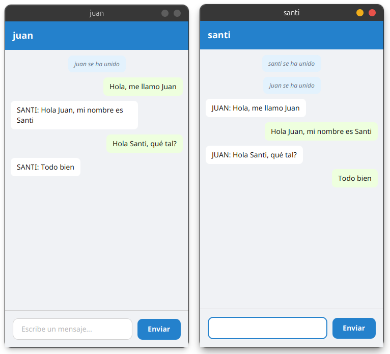

# Chat Multicliente

**Programación de Servicios y Procesos**

Aplicación de mensajería grupal con Sockets y JavaFX

---

**Autor:** Santi Martínez

**Tecnologías:** Java 21 | JavaFX | Sockets | Maven

**Fecha:** 21 de enero de 2026

---

## Índice

1. [Introducción](#introducción)
2. [Arquitectura del Sistema](#arquitectura-del-sistema)
3. [Implementación del Servidor](#implementación-del-servidor)
4. [Implementación del Cliente](#implementación-del-cliente)
5. [Protocolo de Comunicación](#protocolo-de-comunicación)
6. [Interfaz de Usuario](#interfaz-de-usuario)
7. [Compilación y Ejecución](#compilación-y-ejecución)
8. [Problemas Encontrados y Soluciones](#problemas-encontrados-y-soluciones)
9. [Conclusión](#conclusión)
10. [Bibliografía](#bibliografía)

---

## Introducción

Esta documentación desarrolla un **sistema de chat multicliente** implementado en Java, utilizando sockets TCP/IP para la comunicación en red y JavaFX para la interfaz gráfica de usuario.

El proyecto tiene como objetivo demostrar la implementación práctica de conceptos fundamentales de programación concurrente, comunicación en red y desarrollo de interfaces gráficas, creando una aplicación funcional que permite la comunicación simultánea entre múltiples usuarios conectados a través de una red local o internet.

### Contexto del Proyecto

En el ámbito de la programación de servicios y procesos, la comunicación cliente-servidor mediante sockets representa uno de los pilares fundamentales para el desarrollo de aplicaciones distribuidas. Este proyecto surge como respuesta a la necesidad de implementar un sistema que permita:

- La comunicación en tiempo real entre múltiples clientes
- La gestión eficiente de conexiones concurrentes mediante hilos
- Una interfaz de usuario intuitiva y responsiva
- El manejo robusto de errores y desconexiones inesperadas

### Objetivos del Proyecto

Los objetivos específicos que se persiguen con este desarrollo son:

1. **Implementar un servidor multihilo** capaz de gestionar conexiones simultáneas de múltiples clientes
2. **Desarrollar un cliente con interfaz gráfica** utilizando JavaFX que permita una experiencia de usuario fluida
3. **Gestionar la comunicación** mediante sockets TCP/IP, asegurando la transmisión fiable de mensajes
4. **Aplicar conceptos de programación concurrente** para garantizar la sincronización correcta entre hilos
5. **Implementar un sistema de difusión** (broadcast) que permita enviar mensajes a todos los clientes conectados
6. **Manejar eventos de conexión y desconexión** de forma transparente para los usuarios

### Tecnologías Utilizadas

El proyecto se desarrolla sobre las siguientes tecnologías y herramientas:

- **Java 21**: Versión LTS del lenguaje, aprovechando las últimas características y mejoras de rendimiento
- **JavaFX 21.0.6**: Framework para desarrollo de interfaces gráficas modernas y responsivas
- **Maven**: Herramienta de gestión de dependencias y construcción del proyecto
- **Sockets TCP/IP**: API de Java para comunicación en red
- **Threads y Concurrencia**: ExecutorService, ConcurrentHashMap para gestión de hilos

### Estructura de la Documentación

Este documento se organiza en las siguientes secciones:

- **Arquitectura del Sistema**: Descripción general de la estructura y componentes principales
- **Implementación del Servidor**: Análisis detallado del componente servidor y gestión de clientes
- **Implementación del Cliente**: Desarrollo del cliente con interfaz gráfica
- **Protocolo de Comunicación**: Protocolo de mensajes y flujo de información
- **Interfaz de Usuario**: Diseño y funcionalidades de la GUI con JavaFX
- **Problemas y Soluciones**: Dificultades encontradas durante el desarrollo
- **Conclusiones**: Reflexiones finales y aprendizajes del proyecto

---

## Arquitectura del Sistema

La aplicación de chat multicliente sigue una arquitectura cliente-servidor clásica, donde un servidor central gestiona las conexiones y redistribuye los mensajes entre todos los clientes conectados.

### Visión General

El sistema se compone de los siguientes elementos principales:

- **Servidor Central**: Acepta conexiones entrantes, crea un hilo para cada cliente y gestiona la difusión de mensajes
- **Clientes JavaFX**: Aplicaciones con interfaz gráfica que se conectan al servidor
- **Protocolo de Comunicación**: Basado en líneas de texto sobre sockets TCP/IP
- **Sistema de Broadcast**: Mecanismo para enviar mensajes a todos los clientes simultáneamente

### Estructura de Paquetes

El proyecto está organizado en paquetes siguiendo principios de separación de responsabilidades:

- **com.chat.chatmulticlithreads.servicios**: Contiene las clases relacionadas con el servidor y la gestión de clientes (**Servidor**, **HandlerCliente**)
- **com.chat.chatmulticlithreads.cliente**: Incluye las clases del cliente JavaFX (**App**, **MainController**, **Launcher**)
- **resources**: Archivos de recursos como FXML y CSS para la interfaz gráfica
- **pom.xml**: Archivo de configuración de Maven con dependencias y plugins

### Diagrama de Componentes

El siguiente diagrama ilustra la relación entre los componentes principales:

```
Cliente 1 (JavaFX) ↔ HandlerCliente 1
                                      ↔ Servidor
Cliente 2 (JavaFX) ↔ HandlerCliente 2 ↔

Cliente N (JavaFX) ↔ HandlerCliente N
```

### Principios de Diseño Aplicados

#### Separación de Responsabilidades

Cada clase tiene una responsabilidad única y bien definida:

- **Servidor**: Aceptar conexiones y coordinar broadcast
- **HandlerCliente**: Gestionar comunicación con un cliente específico
- **App**: Inicializar interfaz gráfica y conectar al servidor
- **MainController**: Controlar eventos de UI y mostrar mensajes

#### Concurrencia Controlada

El manejo de múltiples clientes simultáneos se realiza mediante:

- **ExecutorService** con pool de hilos cacheados
- **ConcurrentHashMap.newKeySet()** para almacenar clientes de forma thread-safe
- Sincronización automática en operaciones de broadcast

#### Modularidad

La separación entre lógica de red y presentación permite:

- Probar el servidor independientemente de la interfaz
- Reemplazar la GUI sin modificar la lógica de red
- Extender funcionalidades sin afectar componentes existentes

---

## Implementación del Servidor

El servidor es el componente central que coordina toda la comunicación entre clientes. Su responsabilidad principal es aceptar conexiones entrantes y gestionar el envío de mensajes entre todos los participantes.

### Clase Servidor

La clase **Servidor** implementa el socket servidor que escucha en un puerto específico y crea un nuevo **HandlerCliente** para cada conexión entrante.

```java
public class Servidor {
    private static final int PUERTO = 8080;
    public static final Set<HandlerCliente> clientes = 
        ConcurrentHashMap.newKeySet();

    public static void main(String[] args) {
        ExecutorService pool = Executors.newCachedThreadPool();
        System.out.println("Servidor iniciado en puerto " + PUERTO);

        try (ServerSocket serverSocket = new ServerSocket(PUERTO)) {
            while (true) {
                Socket socket = serverSocket.accept();
                System.out.println("Cliente conectado: " + 
                    socket.getInetAddress());
                pool.execute(new HandlerCliente(socket));
            }
        } catch (IOException e) {
            System.err.println("Error: " + e.getMessage());
        }
    }

    public static void broadcast(String mensaje) {
        clientes.forEach(c -> c.enviar(mensaje));
    }
}
```

### Características del Servidor

#### Puerto de Escucha

El servidor escucha en el puerto **8080**. Esta es una constante que puede modificarse según las necesidades de despliegue.

#### Gestión de Clientes

Se utiliza un **ConcurrentHashMap.newKeySet()** para almacenar los manejadores de clientes activos. Esta estructura de datos es thread-safe y permite operaciones concurrentes sin necesidad de sincronización explícita.

#### Pool de Hilos

El servidor utiliza un **ExecutorService** con **newCachedThreadPool()**, que crea hilos según sea necesario y reutiliza hilos inactivos, optimizando el uso de recursos.

#### Método Broadcast

El método **broadcast()** es estático y puede ser invocado desde cualquier **HandlerCliente** para enviar un mensaje a todos los clientes conectados simultáneamente.

### Clase HandlerCliente

Cada cliente conectado es gestionado por una instancia de **HandlerCliente**, que se ejecuta en su propio hilo.

```java
public class HandlerCliente implements Runnable {
    private final Socket socket;
    private PrintWriter salida;
    private String nombre;
    
    public HandlerCliente(Socket socket) {
        this.socket = socket;
    }

    @Override
    public void run() {
        try {
            BufferedReader entrada = new BufferedReader(
                new InputStreamReader(socket.getInputStream()));
            salida = new PrintWriter(socket.getOutputStream(), true);

            nombre = entrada.readLine();
            if (nombre == null || nombre.isEmpty()) nombre = "Usuario";

            Servidor.clientes.add(this);
            Servidor.broadcast(nombre + " se ha unido");

            String mensaje;
            while ((mensaje = entrada.readLine()) != null) {
                if (mensaje.equalsIgnoreCase("salir"))
                    break;
                Servidor.broadcast(mensaje);
            }
        } catch (IOException e) {
            // Cliente desconectado
        } finally {
            Servidor.clientes.remove(this);
            if (nombre != null) Servidor.broadcast(nombre + " se ha ido");
            try {socket.close();} catch (IOException ignored) {}
        }
    }
    
    public void enviar(String mensaje) {
        if (salida != null)
            salida.println(mensaje);
    }
}
```

### Ciclo de Vida de una Conexión

1. **Aceptación**: El servidor acepta la conexión y se abre en el puerto 8080.
2. **Creación**: Se instancia un **Cliente** con el socket.
3. **Registro**: El cliente se añade al conjunto de clientes activos
4. **Anuncio**: Se notifica a todos que el cliente se ha unido
5. **Escucha**: Se entra en un bucle para recibir mensajes
6. **Broadcast**: Cada mensaje recibido se reenvía a todos
7. **Desconexión**: Al cerrar, se elimina del conjunto y se notifica en el chat general.

---

## Implementación del Cliente

El cliente es una aplicación JavaFX que proporciona una interfaz gráfica intuitiva para conectarse al servidor y participar en el chat.

### Clase App

La clase **App** es el punto de entrada de la aplicación JavaFX y gestiona el ciclo de vida de la interfaz gráfica.

### Características del Cliente

#### Separación Servidor-Cliente

El servidor y los clientes ahora están completamente separados, lo que permite un control más preciso sobre su ejecución. Existen dos launchers independientes:

- **LauncherServidor.java**: Inicia únicamente el servidor en el puerto 8080
- **Launcher.java**: Inicia instancias de clientes que se conectan al servidor

Esta arquitectura permite:

- Ejecutar el servidor en una máquina dedicada
- Conectar clientes desde diferentes dispositivos en la red
- Mejor control y depuración del servidor y clientes por separado
- Reiniciar clientes sin afectar al servidor o viceversa

#### Validación de Conexión

El cliente verifica que el servidor esté disponible antes de abrir la interfaz gráfica. Si no puede establecer conexión, muestra un mensaje de error informando al usuario que debe iniciar primero el servidor.

#### Diálogo de Identificación

Al iniciar, se solicita al usuario que introduzca su nombre mediante un **TextInputDialog**. Este nombre se envía al servidor como primer mensaje y se utiliza para identificar los mensajes del usuario.

#### Carga de la Interfaz

La interfaz se carga desde un archivo FXML (**index.fxml**), lo que separa la estructura de la UI del código lógico y facilita el diseño visual.

### Clase MainController

El controlador gestiona todos los eventos de la interfaz y la comunicación con el servidor.

```java
public class MainController {
    @FXML
    private VBox contenedor_chat_cuerpo;
    @FXML
    private TextField input_mensaje;
    @FXML
    private ScrollPane chat;
    @FXML
    private Label label_titulo_chat;
    
    private Socket socket;
    private PrintWriter salida;
    private String nombreCliente;
    
    public void setNombreCliente(String nombre) {
        this.nombreCliente = nombre;
        label_titulo_chat.setText(nombre);
    }

    public void conectarAlServidor() {
        try {
            socket = new Socket("localhost", 8080);
            salida = new PrintWriter(socket.getOutputStream(), true);
            BufferedReader entrada = new BufferedReader(
                new InputStreamReader(socket.getInputStream()));
            salida.println(nombreCliente);

            new Thread(() -> {
                try {
                    String msg;
                    while ((msg = entrada.readLine()) != null) {
                        String m = msg;
                        Platform.runLater(() -> agregarMensaje(m));
                    }
                } catch (IOException e) {
                }
            }).start();
        } catch (IOException e) { 
            agregarMensaje("Error: " + e.getMessage());
        }
    }
}
```

### Gestión de Mensajes

#### Envío de Mensajes

Cuando el usuario presiona Enter o hace clic en el botón de enviar, se ejecuta el método **enviarMensaje()**:

```java
@FXML
private void enviarMensaje() {
    String msg = input_mensaje.getText().trim();
    if (!msg.isEmpty() && salida != null) {
        salida.println("[" + nombreCliente.toUpperCase() + "]: " + msg);
        agregarMensajePropio(msg);
        input_mensaje.clear();
    }
}
```

#### Recepción de Mensajes

Un hilo separado escucha continuamente los mensajes entrantes del servidor. Para actualizar la interfaz de forma segura, se utiliza **Platform.runLater()**:

```java
new Thread(() -> {
    try {
        String msg;
        while ((msg = entrada.readLine()) != null) {
            String m = msg;
            Platform.runLater(() -> agregarMensaje(m));
        }
    } catch (IOException e) {
    }
}).start();
```

---

## Protocolo de Comunicación

El protocolo implementado es simple pero efectivo, basado en el intercambio de líneas de texto sobre sockets TCP/IP.

### Formato de Mensajes

Los mensajes siguen una estructura específica:

- **Identificación**: Primera línea enviada por el cliente contiene el nombre de usuario
- **Mensajes de chat**: Formato **[NOMBRE]: contenido del mensaje**
- **Notificaciones**: **Usuario se ha unido** o **Usuario se ha ido**
- **Comando de salida**: **Salir** para cerrar la conexión

### Flujo de Comunicación

1. Cliente se conecta al servidor en el puerto 8080
2. Cliente envía su nombre como primera línea
3. Servidor añade el cliente al conjunto de participantes
4. Servidor notifica a todos: **Usuario se ha unido**
5. Cliente puede enviar mensajes que se redistribuyen a todos
6. Al cerrar, servidor notifica: **Usuario se ha ido**

### Diagrama de Secuencia

```
Cliente → Servidor: Conexión

Cliente → Servidor: "Juan"

Servidor → Todos: "Juan se ha unido"

Cliente → Servidor: "[JUAN]: Hola a todos"

Servidor → Todos: "[JUAN]: Hola a todos"

Cliente → Servidor: "salir"

Servidor → Todos: "Juan se ha ido"
```

---

## Interfaz de Usuario

La interfaz gráfica está diseñada para ser simple e intuitiva, proporcionando una experiencia de chat similar a aplicaciones de mensajería modernas.

En primera instancia, se solicita al usuario su nombre de usuario:


Al introducir un nombre, se muestra la ventana principal del chat, en la que aparece el mensaje de bienvenida.


Múltiples usuarios pueden conectarse simultáneamente y ver los mensajes en tiempo real. La representación visual distingue entre mensajes propios y de otros usuarios, además de notificar las entradas y salidas del chat.



Para abandonar el chat, el usuario puede cerrar la ventana utilizando el botón de cierre estándar de la ventana.


Al cerrar la ventana, el cliente se desconecta del servidor y se notifica a los demás usuarios. El siguiente ejemplo muestra cómo se ve cuando un usuario sale del chat:


### Componentes de la Interfaz

La interfaz se compone de los siguientes elementos:

- **Etiqueta de título**: Muestra el nombre del usuario
- **Área de mensajes**: ScrollPane con VBox que contiene todos los mensajes
- **Campo de entrada**: TextField para escribir mensajes
- **Diferenciación visual**: Mensajes propios a la derecha, recibidos a la izquierda

### Archivo FXML

La estructura de la interfaz se define en el archivo **index.fxml**, que describe la jerarquía de componentes JavaFX.

### Estilos CSS

El archivo **styles.css** define los estilos visuales de la aplicación:

- Estilos para mensajes enviados: alineados a la derecha
- Estilos para mensajes recibidos: alineados a la izquierda
- Colores y tipografía coherentes
- Diseño responsive que se adapta al contenido

### Métodos de Visualización

#### Agregar Mensaje Propio

```java
private void agregarMensajePropio(String texto) {
    Label label = new Label(texto);
    label.setWrapText(true);
    label.getStyleClass().add("mensaje");
    label.getStyleClass().add("mensaje_enviado");

    HBox contenedor = new HBox(label);
    contenedor.setAlignment(Pos.CENTER_RIGHT);
    contenedor_chat_cuerpo.getChildren().add(contenedor);
    chat.setVvalue(1.0); // Scroll al final
}
```

#### Agregar Mensaje Recibido

```java
private void agregarMensaje(String texto) {
    if (texto.startsWith("[" + nombreCliente.toUpperCase() + "]: ")) {
        return; // Ignorar mensajes propios
    }
    Label label = new Label(texto);
    label.setWrapText(true);
    label.getStyleClass().add("mensaje");
    label.getStyleClass().add("mensaje_recibido");

    HBox contenedor = new HBox(label);
    contenedor.setAlignment(Pos.CENTER_LEFT);
    contenedor_chat_cuerpo.getChildren().add(contenedor);
    chat.setVvalue(1.0);
}
```

---

## Compilación y Ejecución

El proyecto utiliza Maven como herramienta de gestión de dependencias y construcción.

### Estructura del POM

El archivo **pom.xml** define las dependencias y plugins necesarios:

- **JavaFX Controls**: Para componentes de interfaz gráfica
- **JavaFX FXML**: Para cargar archivos FXML
- **Maven Compiler Plugin**: Configurado para Java 21
- **JavaFX Maven Plugin**: Para ejecutar la aplicación

### Comandos de Ejecución

#### Compilar el Proyecto

```bash
mvn clean compile
```

#### Ejecutar el Servidor

Primero, es necesario iniciar el servidor. Este se inicia con click derecho en **LauncherServidor.java** y seleccionar Run Java.

#### Ejecutar Clientes

Una vez el servidor está en ejecución, se pueden iniciar múltiples clientes:

```bash
mvn javafx:run
```

O ejecutar directamente la clase **Launcher.java** desde el IDE.

#### Ejecutar Múltiples Instancias

Para probar el chat con varios usuarios, se pueden ejecutar múltiples instancias del cliente en terminales diferentes. Cada instancia actuará como un usuario separado. Esta es la verdadera ventaja de tener el servidor y cliente separados.

### Clases Launcher

#### LauncherServidor

La clase **LauncherServidor** inicia únicamente el servidor:

```java
public class LauncherServidor {
    public static void main(String[] args) {
        System.out.println("=== INICIANDO SERVIDOR DE CHAT ===");
        Servidor.main(args);
    }
}
```

#### Launcher

La clase **Launcher** inicia instancias del cliente:

```java
public class Launcher {
    public static void main(String[] args) {
        Application.launch(App.class, args);
    }
}
```

---

## Problemas Encontrados y Soluciones

Durante el desarrollo del proyecto se enfrentaron diversos desafíos técnicos que requirieron soluciones específicas.

### Problema 1: Sincronización de Hilos

**Descripción**: Inicialmente se utilizaba un **ArrayList** para almacenar los clientes, lo que causaba **ConcurrentModificationException** cuando múltiples hilos intentaban modificar la lista simultáneamente.

**Solución**: Se reemplazó el **ArrayList** por **ConcurrentHashMap.newKeySet()**, que es thread-safe y permite operaciones concurrentes sin sincronización explícita.

### Problema 2: Actualización de la Interfaz desde Hilos

**Descripción**: Al intentar actualizar la interfaz JavaFX directamente desde el hilo de recepción de mensajes, se producían excepciones porque JavaFX requiere que todas las actualizaciones de UI se hagan desde el hilo de aplicación JavaFX.

**Solución**: Se utilizó **Platform.runLater()** para encolar las actualizaciones de interfaz en el hilo correcto:

```java
Platform.runLater(() -> agregarMensaje(mensaje));
```

### Problema 3: Cierre de Conexiones

**Descripción**: Al cerrar una ventana de cliente, el servidor no siempre detectaba la desconexión inmediatamente, dejando referencias a clientes inactivos.

**Solución**: Se implementó un bloque **finally** en **HandlerCliente** que garantiza la limpieza de recursos:

```java
finally {
    Servidor.clientes.remove(this);
    if (nombre != null) {
        Servidor.broadcast(nombre + " se ha ido");
    }
    try {
        socket.close();
    } catch (IOException ignored) {
    }
}
```

### Problema 4: Mensajes Duplicados

**Descripción**: Los clientes veían sus propios mensajes duplicados: uno al enviar y otro cuando el servidor los redistribuía.

**Solución**: Se implementó un filtro en **agregarMensaje()** que ignora los mensajes que comienzan con el nombre del cliente actual:

```java
if (texto.startsWith("[" + nombreCliente.toUpperCase() + "]: ")) {
    return;
}
```

### Problema 5: Configuración del Puerto

**Descripción**: En algunos sistemas, el puerto 8080 ya estaba en uso por otras aplicaciones (como servidores web de desarrollo).

**Solución**: Se documentó el puerto como constante configurable y se proporcionó información sobre cómo liberar puertos en el archivo **liberarPuertos.md**.

### Problema 6: Scroll Automático

**Descripción**: Al recibir nuevos mensajes, el área de chat no se desplazaba automáticamente hacia abajo, obligando al usuario a hacer scroll manualmente.

**Solución**: Se añadió **chat.setVvalue(1.0)** después de agregar cada mensaje para posicionar el scroll al final automáticamente.

### Problema 7: Mensajes Propios Aparecen Dos Veces

**Descripción**: Los mensajes enviados por el usuario aparecían duplicados: una vez como mensaje propio (alineado a la derecha) y otra vez como mensaje recibido del servidor (alineado a la izquierda). El problema radicaba en que el cliente agregaba el mensaje localmente y luego el servidor lo retransmitía a todos los clientes, incluyendo al emisor.

**Solución**: Se implementó un filtro en el método **agregarMensaje()** que detecta y descarta los mensajes propios cuando vienen del servidor. El filtro compara el prefijo del mensaje con el nombre del usuario en mayúsculas.

### Problema 8: Formato Incorrecto en Mensajes de Otros Usuarios

**Descripción**: Los mensajes de otros usuarios aparecían con el formato "juan: [JUAN]: mensaje", mostrando el nombre duplicado y en diferentes formatos. Esto ocurría porque el cliente enviaba el mensaje con formato "[NOMBRE]: mensaje" y luego el servidor añadía otro prefijo "nombre: ".

**Solución**: Se modificó el flujo de mensajes para que:

1. El cliente envíe únicamente el texto del mensaje sin agregar su nombre
2. El servidor sea quien añada el nombre del remitente en mayúsculas
3. El formato final sea consistente: "NOMBRE: mensaje"

```java
// Cambio en el cliente
// Antes: salida.println("[" + nombreCliente + "]: " + msg);
// Ahora: 
salida.println(msg);  // Solo enviar el texto
```

```java
// Cambio en el servidor
// El servidor formatea el mensaje:
Servidor.broadcast(nombre.toUpperCase() + ": " + mensaje);
```

### Problema 9: Inicio Acoplado de Servidor y Cliente

**Descripción**: Inicialmente, el servidor se iniciaba automáticamente con la primera instancia del cliente. Esto causaba problemas:

- Imposibilidad de ejecutar el servidor en una máquina separada
- Dificultad para depurar servidor y cliente de forma independiente
- No se podía reiniciar el servidor sin cerrar todos los clientes
- Complejidad innecesaria en el código del cliente

**Solución**: Se separó completamente el inicio del servidor y los clientes:

1. Se creó **LauncherServidor.java** como punto de entrada exclusivo del servidor
2. Se eliminó la lógica de inicio automático del servidor en **App.java**
3. Se añadió validación de conexión que verifica que el servidor esté disponible
4. Se implementó mensaje de error informativo si el servidor no está ejecutándose

Esta arquitectura permite mayor flexibilidad y facilita el desarrollo, depuración y despliegue de la aplicación.

---

## Conclusión

El desarrollo de este sistema de chat multicliente ha permitido poner en práctica nuevos conceptos de programación concurrente y la creación de sockets.

### Objetivos Alcanzados

- Se implementó un servidor robusto capaz de gestionar múltiples conexiones simultáneas mediante un pool de hilos.
- Se desarrolló un cliente con interfaz gráfica utilizando JavaFX.
- Se estableció un protocolo de comunicación basado en sockets TCP/IP.
- Aplicación de conceptos de programación concurrente para garantizar la sincronización
- Sistema de broadcast para la comunicación grupal.
- Gestión adecuada de eventos durante el proceso de conexión, desconexión y envío de mensajes.

### Aprendizajes Técnicos

1. **Programación concurrente**: Comprensión profunda del uso de **ExecutorService** y gestión de hilos.

2. **Comunicación en red**: Experiencia práctica con sockets TCP/IP, flujos de entrada/salida y manejo de conexiones de red.

### Posibles Mejoras Futuras

Aunque el sistema cumple con los requisitos funcionales, existen oportunidades de mejora:

- **Persistencia de mensajes**: Almacenar el historial de chat en una base de datos
- **Salas múltiples**: Permitir crear y unirse a diferentes salas de chat
- **Mensajes privados**: Implementar comunicación directa entre dos usuarios
- **Autenticación**: Añadir sistema de registro e inicio de sesión
- **Cifrado**: Implementar comunicación segura mediante SSL/TLS
- **Indicadores de estado**: Mostrar qué usuarios están escribiendo o conectados
- **Compartir archivos**: Permitir el intercambio de imágenes y documentos
- **Emojis y formato**: Añadir soporte para emoticonos y formato de texto

---

## Bibliografía

- **Documentación oficial de Java**: [Oracle Java SE 21 Documentation](https://docs.oracle.com/en/java/javase/21/)

- **Socket Programming en Java**: [Baeldung - Guide to Java Sockets](https://www.baeldung.com/a-guide-to-java-sockets)

- **ExecutorService y Thread Pools**: [Baeldung - ExecutorService Tutorial](https://www.baeldung.com/java-executor-service-tutorial)

- **JavaFX FXML**: [Introduction to FXML](https://openjfx.io/javadoc/21/javafx.fxml/javafx/fxml/doc-files/introduction_to_fxml.html)

- **ConcurrentHashMap en Java**: [Baeldung - ConcurrentHashMap Guide](https://www.baeldung.com/java-concurrent-map)

- **Platform.runLater() en JavaFX**: [JavaFX Platform API Documentation](https://docs.oracle.com/javase/8/javafx/api/javafx/application/Platform.html)

- **TCP/IP Protocol**: [RFC 793 - Transmission Control Protocol](https://www.rfc-editor.org/rfc/rfc793)

- **Maven JavaFX Plugin**: [OpenJFX Maven Plugin GitHub](https://github.com/openjfx/javafx-maven-plugin)
